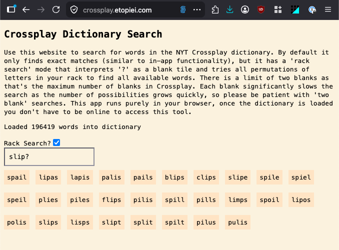

# crossplay-words

**https://crossplay.etopiei.com**

There are a bunch of sites out there for scrabble search/solving but in general they are based around different dictionaries.

This site lets you search through the NYT crossplay dictionary, as well as do 'smart matching' by typing '?' to indicate blank tiles and look for 
rearrangements of your rack.

## Example

## Developing

Requires shadow-cljs and clojure installed.

Start with `shadow-cljs watch app`
